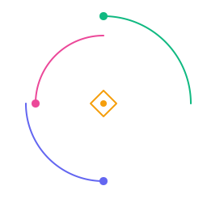

# Inspira



## About Inspira

**Inspira** delivers a **daily drop of original design inspiration**.  
Every single day, one new hand-crafted design is shared, curated and created by **Reginald Sahil Chand**, with the goal of sparking ideas and fueling creativity.

The project is intentionally simple in its first iteration: no clutter, no noise, just a consistent daily ritual of fresh design. Over time, it will grow into a more community-driven space with authentication, favorites, and personalization.

---

## Brand & Identity

The brand is rooted in three pillars:

- **Design** → representing the curated creative work that Inspira publishes.
- **Development** → representing the platform itself, a reliable delivery mechanism for daily inspiration.
- **AI** → representing both the role of prompt engineering in shaping Inspira’s brand identity and the way AI is used in the design process itself, whether for idea generation, image creation, or blending imagination with AI-driven creativity.

### Logo

The Inspira logo (`/public/logo-brand.svg`) was designed through **AI-aided prompt engineering**, then refined by hand.  
It’s built around **geometric orbits and sparks**, symbolizing:

- **Design**: represented by one orbital path, standing for creativity and craft.
- **Development**: represented by a second orbit, signifying structure, delivery, and consistency.
- **AI**: represented by a third orbit, showing motion, innovation, and the spark of inspiration.
- **Core spark**: a centered spark-shaped mark represents the daily drop, one design, one point of ignition each day.

The logo is minimal, transparent, and scalable, making it suitable for both branding and motion (loading animations, transitions, etc.).

| Token                             | Light (oklch)          | Dark (oklch)           |
| --------------------------------- | ---------------------- | ---------------------- |
| `--inspira-design-primary`        | `oklch(0.72 0.22 340)` | `oklch(0.82 0.20 340)` |
| `--inspira-development-secondary` | `oklch(0.65 0.20 270)` | `oklch(0.80 0.16 270)` |
| `--inspira-ai-accent`             | `oklch(0.70 0.18 150)` | `oklch(0.80 0.14 150)` |
| `--inspira-spark-highlight`       | `oklch(0.78 0.18 80)`  | `oklch(0.88 0.14 80)`  |

---

## Tech Stack

- **Frontend:**

  - [Next.js](https://nextjs.org/) (React + TypeScript)
  - [TailwindCSS](https://tailwindcss.com/) for utility-first styling
  - [shadcn/ui](https://ui.shadcn.com/) for modern, accessible components

- **Backend & Storage:**

  - [Cloudflare R2](https://developers.cloudflare.com/r2/) for scalable asset storage
  - [Supabase](https://supabase.com/) as an optional backend service
  - [Prisma](https://www.prisma.io/) or equivalent ORM (if/when relational data is needed)

- **Other:**
  - PWA-ready metadata and manifest
  - AI prompt-engineering-driven branding

---

## Philosophy

Inspira is not about mass content, it’s about **one original drop, every day**.  
The aim is to make inspiration sustainable: a daily practice for both the creator and the viewer. By keeping scope small in v1, the project ensures clarity and space for growth in v2 and beyond.

---

## Getting Started

This is a [Next.js](https://nextjs.org) project bootstrapped with [`create-next-app`](https://nextjs.org/docs/app/api-reference/cli/create-next-app).

First, run the development server:

```bash
npm run dev
# or
yarn dev
# or
pnpm dev
# or
bun dev
```

Open [http://localhost:3000](http://localhost:3000) with your browser to see the result.

You can start editing the page by modifying `app/page.tsx`. The page auto-updates as you edit the file.

This project uses [`next/font`](https://nextjs.org/docs/app/building-your-application/optimizing/fonts) to automatically optimize and load [Geist](https://vercel.com/font), a new font family for Vercel.

## Learn More

To learn more about Next.js, take a look at the following resources:

- [Next.js Documentation](https://nextjs.org/docs) - learn about Next.js features and API.
- [Learn Next.js](https://nextjs.org/learn) - an interactive Next.js tutorial.

You can check out [the Next.js GitHub repository](https://github.com/vercel/next.js) - your feedback and contributions are welcome!

## Deploy on Vercel

The easiest way to deploy your Next.js app is to use the [Vercel Platform](https://vercel.com/new?utm_medium=default-template&filter=next.js&utm_source=create-next-app&utm_campaign=create-next-app-readme) from the creators of Next.js.

Check out our [Next.js deployment documentation](https://nextjs.org/docs/app/building-your-application/deploying) for more details.

---

## License

This project is licensed under the [MIT License](LICENSE).

---

**Note:** This README was generated in collaboration with ChatGPT to ensure clarity, polish, and a modern structure.

###### Designed & Developed with ❤️ & ☕ by Reginald Sahil Chand | Fiji Islands
